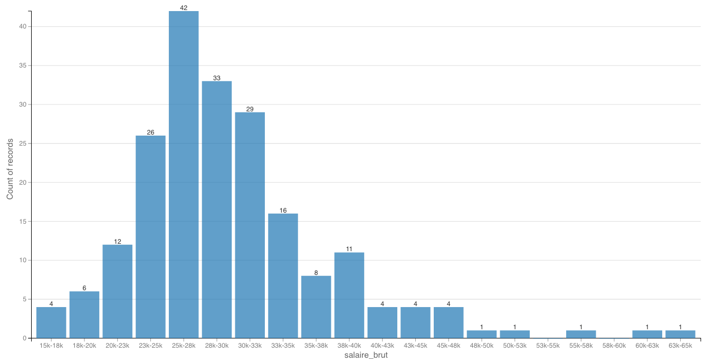
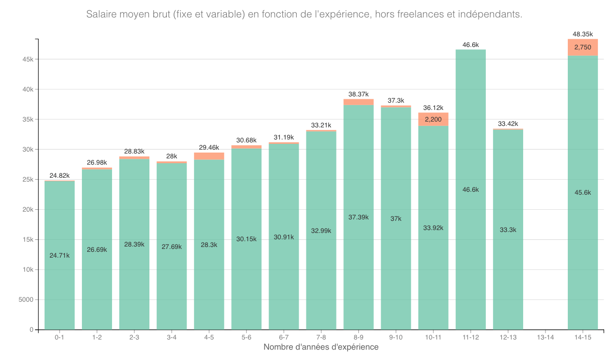
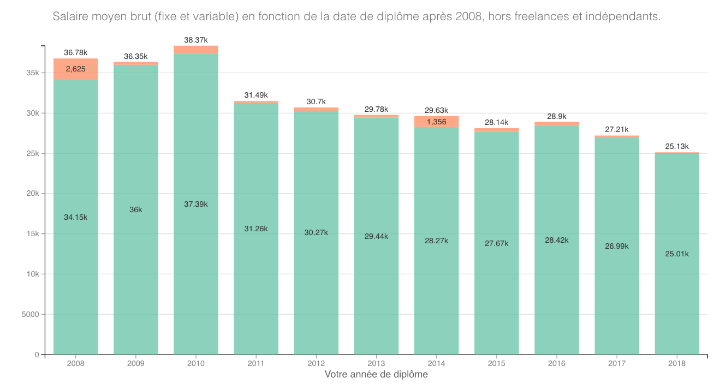
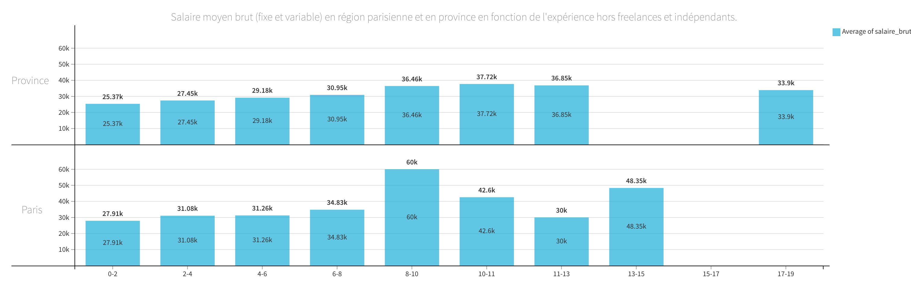
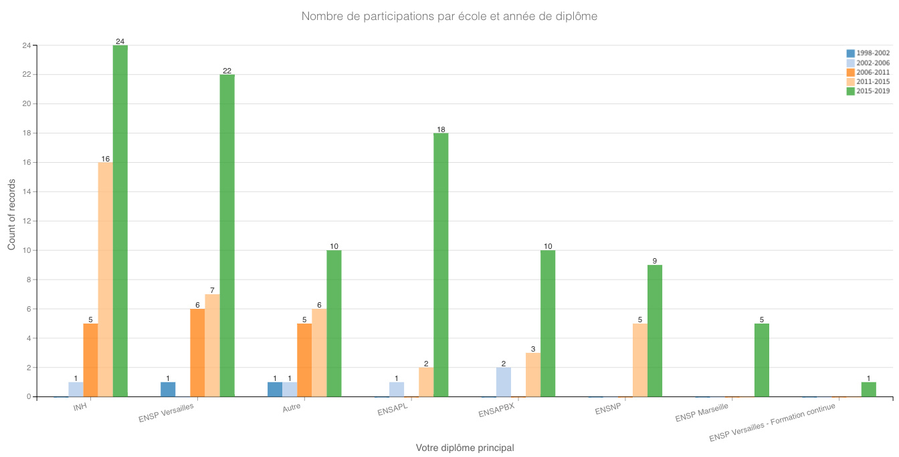

**Depuis le 30 octobre 2018**, nous avons été **plus de 225** à répondre à l'appel. Pour gagner en pertinence, n'hésitez pas à partager votre expérience en répondant sur **[cette page](https://framaforms.org/etude-salaire-2018-paysagiste-concepteur-1538819660) d'ici le 31 mars 2019** (date de clôture de l'étude).

# UNE ETUDE COLLABORATIVE
Vous êtes **élève en 4ème ou en terminale** et cherchez à vous orientez dans le domaine du paysage sans trop savoir à quoi cela correspond ? Vous êtes **étudiant en école supérieure de Paysage** et vous aimeriez connaître ce qui vous attend à la sortie du cursus universitaire dans le monde entrepreunarial ? Vous êtes **en recherche d'emploi** et souhaitez connaître la moyenne de rémunération pour savoir à quoi prétendre ? Vous êtes **promu-e** et allez bientôt négocier une rémunération corrélée au nouveau poste ? 

Cette **première étude collaborative** sur la rémunération des paysagistes concepteurs est faite pour répondre à vos questions. Elle a pour but de rendre visible la rémunération moyenne des paysagistes concepteurs pour les différents postes que nous occupons. _Autrement dit, elle participe à définir "le marché" du paysage..._

Vous souhaitez avoir les résultats finaux de l'étude ? Alors n'hésitez pas à compléter **[ce formulaire](https://framaforms.org/etude-salaire-2018-paysagiste-concepteur-1538822319?fbclid=IwAR1G4hlpyGBrsupSPWVM9ElzkiO4M5gKo-Z_wx0vYQ4hgsozU_ZTxpKAiM4).** Les données brutes sont aussi disponibles [ici](https://github.com/pocman/etude-salariale-paysagiste-concepteur).

_Cette étude a été réfléchie de façon isolée et montre aujourd'hui certains manques. Ils seront intégrés pour la prochaine étude salariale 2019, comme par exemples le sexe de l'employé-e, le nombre d'heures travaillées à la semaine, les postes en Assistance à la Maîtrise d'Ouvrage (AMO) et compétences associées. N'hésitez donc pas à transmettre vos interrogations et appréciations par le biais du second formulaire._

# CONTEXTE DE L’ÉTUDE
J'ai négocié un contrat que j'ai accepté depuis deux ans... Mais voilà, sans véritable visibilité de la rémunération générale des jeunes paysagistes, j'ai accepté assez bêtement 25K car l'entreprise me disait que cela reflétait "le marché".
A quoi j'aurais réellement pu prétendre ? Est-ce que ceux à postes équivalents, en province, sont payés plus ou moins ? Quelle est la différence entre province et Paris ? En somme, quel est le marché actuel ?

**Chapitre I...**

Par le biais de cette étude salariale, le but est d'avoir une vision limpide (dans l'absolu) de la réalité du marché et des différents postes auxquels les paysagistes concepteurs répondent et avec quelle rémunération en fonction des compétences et acquis. 
C'est un moyen d'engager une démarche nationale pour faire valoir nos compétences auprès des entreprises et structures qui profitent de ce flou artistique autour "du marché".

**Chapitre II...**

A l'arrivée de cette fin d'année, il me semble important de récolter un maximum d'informations pour cette année 2018 et de mettre en forme les résultats pour davantage de visibilité. Ils serviront à ceux qui réfléchissent à faire des études en paysage, à ceux qui sont étudiants et qui se demandent à quoi ils peuvent prétendre pour leur première expérience professionnelle, à ceux qui sont déjà actifs.

**N’hésitez pas à relayer auprès de vos ami-e-s de Bordeaux, de Versailles, de Marseille, de Gembloux, de l'INH, de Blois, de l'ESAJ, de l'HEP, de l'ITIAPE...** pour que nous arrivions à faire valoir nos compétences vis à vis des autres métiers, à l'échelle nationale. 
Ce projet pourrait être porté par une structure (fédération, association), mais à l'heure actuelle, il fait office de test. 2019 nous servira à consolider la démarche et toucher plus largement les personnes diplômées paysagistes si jamais nous la portons à plusieurs.

# QUELQUES RÉSULTATS PRELIMINAIRES

Mise à jour le 24/11/2018 sur la base de 225 réponses.

## Quelle est la répartition des salaires parmi les répondants ?

## Quels sont les salaires moyens selon la séniorité ?
Salaire moyen brut (fixe et variable) en fonction de l'expérience, hors freelances et indépendants.

## Quels sont les salaires moyens selon l'année de diplôme ?
Salaire moyen brut (fixe et variable) en fonction de la date de diplôme, hors freelances et indépendants.

# Quelle est la différence de salaires entre Paris et la province ?

Salaire moyen brut (fixe et variable) en fonction de l'expérience et de la région, hors freelances et indépendants.

[L'Insee](https://www.insee.fr/fr/statistiques) table sur un écart de 20 à 25% entre la région parisienne et le reste du pays. Vivre à Paris intra-muros n’offre en revanche que peu de différences de salaires avec les Franciliens.

# Quelle est la différence de salaires par type de poste et années d'expérience ?

## Province

Sur la base de 134 réponses

| Type de poste actuel / Nombre d'années d'expérience  |  0-1  |  1-2  |   2-3   |  3-4  |  4-5  |  5-6  |  6-7  |  7-8  |  8-9  |  9-10 |
|------------------------------------------------------|:-----:|:-----:|:-------:|:-----:|:-----:|:-----:|:-----:|:-----:|:-----:|:-----:|
| Directeur(trice) d'agence                            |       |       |         |       |       | 38850 |       |       | 60000 |       |
| Assistant(e) d'étude                                 |       |       |  34350  |       | 28850 |       |       |       |       |       |
| Chargé(e) d'étude confirmé                           |       |       |         |       |       |       |       |       |       | 31200 |
| Chef(fe) de projet                                   |       | 24610 |  32278  | 34500 |       | 30693 | 25500 | 41000 |       |       |
| Autre                                                | 24960 | 34000 |  24850  |       |       |       | 36000 |       |       | 40000 |
| Chef(fe) de projet débutant                          |       | 25654 |  29640  | 35000 | 31550 | 31700 |       |       |       |       |
| Chargé(e) d'étude                                    |       | 30920 |  28860  | 27332 | 28040 |       |       | 36800 |       |       |
| Assistant(e) de projet                               |       | 27729 |  29912  | 31200 |       | 32600 |       |       |       |       |
| Chargé(e) d'étude débutant                           | 27865 | 27880 |  30300  | 29000 |       |       |       |       |       |       |

## Paris et île-de-France

Sur la base de 57 réponses.

| Type de poste actuel / Nombre d'années d'expérience  |  0-1  |  1-2  |  2-3  |  3-4  |  4-5  |  5-6  |  6-7  |  7-8  |  8-9  |  9-10 |
|------------------------------------------------------|:-----:|:-----:|:-----:|:-----:|:-----:|:-----:|:-----:|:-----:|:-----:|:-----:|
| Directeur(trice) d'agence                            |       |       | 50804 |       | 38500 |       |       | 40850 |       |       |
| Chargé(e) d'étude confirmé                           |       |       |       | 27300 | 28790 |       |       |       | 38133 | 28200 |
| Chef(fe) de projet confirmé                          |       |       |       |       |       |       |       | 21600 |       | 39450 |
| Chef(fe) de projet                                   |       | 31000 | 25438 | 30000 | 31206 |       | 31800 | 28080 | 28810 | 36350 |
| Chargé(e) d'étude                                    | 24050 | 29602 | 27433 | 26064 | 30140 | 28452 |       | 30941 | 38500 |       |
| Chef(fe) de projet débutant                          | 31200 | 23051 | 25740 | 26673 |       |       |       |       |       |       |
| Dessinateur(trice) projeteur                         |       | 21600 | 27084 |       |       |       |       |       |       |       |
| Autre                                                |       | 25204 | 29900 | 18000 | 22625 | 19500 | 29000 |       | 27800 |       |
| Chargé(e) d'étude débutant                           | 21003 | 24426 | 27951 |       |       |       |       |       |       |       |
| Assistant(e) de projet                               | 22750 | 23460 | 25392 | 23371 | 29840 |       |       |       |       |       |
| Directeur(trice) de société                          |       |       |       | 15000 | 21000 |       | 23400 |       |       |       |

# Quelle est la répartition des réponses en fonction des écoles et des années de diplôme ?

# FAQ

Contact: olsjuliette@gmail.com
thomas.poc@gmail.com

